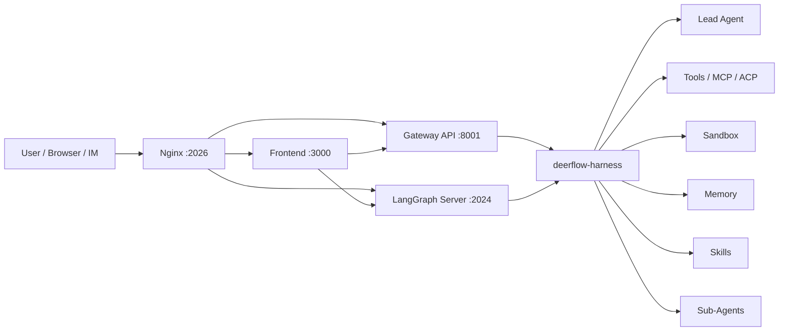

# 08 - DeerFlow 技术分享提纲

> 面向高级后台研发团队的 DeerFlow 技术分享素材母版。后续可以直接拆成 PPT、HTML deck 或演讲稿。

## 分享定位

**推荐标题**：

《DeerFlow：从 Deep Research 到 Super Agent Harness 的工程化实现》

**一句话主线**：

DeerFlow 表面是一个 AI 应用，底层真正值得后台研发学习的是一套 agent runtime 平台：它把模型调用、工具系统、sandbox、memory、skills、sub-agents、流式执行、配置管理和安全治理组织成一个可运行、可扩展、可观测的工程系统。

**目标听众**：

- 后台研发工程师
- Tech Lead / 架构师
- 正在调研 AI Agent 平台、MCP、工具调用、代码执行环境的团队

**建议时长**：

- 45 分钟：讲核心架构、执行链路、skills/subagent/sandbox 三个重点。
- 60 分钟：增加安全治理、生产化落地、现场 demo 和团队可借鉴点。

**分享目标**：

1. 让团队理解 DeerFlow 不是普通 chatbot，而是一个 super agent harness。
2. 从后台架构角度拆解它如何把不稳定的 LLM 行为包装成可治理的运行时系统。
3. 提炼团队可复用的 agent 平台设计原则。

## 核心观点

### 观点一：Agent 应用的本质是 runtime，而不是 prompt

普通 AI 应用通常围绕一次模型调用组织代码；DeerFlow 更接近 runtime：

- 线程生命周期由 LangGraph thread/checkpoint 管理。
- 每次 run 动态构建 agent graph。
- 中间件负责上下文、sandbox、工具错误、guardrail、memory、title、loop detection 等横切能力。
- 工具调用和模型推理由 graph 循环驱动，而不是业务代码手写 while loop。

**可讲的判断标准**：

如果一个系统只有 prompt + tools，它还是 agent demo；如果它有 thread state、checkpoint、runtime middleware、sandbox policy、tool registry、stream bridge、memory queue、audit 和 guardrail，它才开始接近 agent 平台。

### 观点二：DeerFlow 的核心不是某个 agent，而是 harness/app 分层

DeerFlow 后台分成两层：

- `backend/packages/harness/deerflow/`：可复用 harness，包含 agent 编排、tools、sandbox、models、MCP、skills、memory、runtime。
- `backend/app/`：应用层，包含 FastAPI Gateway 和 IM channels。

这个分层值得重点讲。它把“可发布的 agent 基础设施”和“具体产品应用”分开，类似后台系统里 platform SDK 与业务 app 的边界。

### 观点三：复杂 Agent 系统需要把高风险能力平台化

DeerFlow 具备命令执行、文件读写、外部服务调用、长期记忆、MCP 扩展等高权限能力。这些能力不能散落在 prompt 或业务逻辑里，必须进入平台治理：

- 工具注册与分组
- sandbox 路径策略
- guardrail
- audit middleware
- tool error handling
- loop detection
- subagent 并发限制
- memory 更新过滤

这也是后台研发看 DeerFlow 最有价值的地方。

## 推荐目录

### 1. 开场：为什么要研究 DeerFlow

**要讲清的问题**：

- DeerFlow 2.0 是开源的 super agent harness。
- 它不是单一 deep research bot，而是一套 agent runtime 基础设施。
- 对后台研发的价值在于看它如何把 agent 能力工程化。

**可用话术**：

> 今天不重点讲 DeerFlow 能生成什么报告，也不把它当成普通 AI 产品看。我们把它当成一个后台工程样本：一个 agent 系统如果真的要执行任务、调工具、写文件、调用外部服务、产生长任务结果，它的 runtime 应该长什么样。

**Slide 内容建议**：

- 标题：DeerFlow 是什么
- 三个关键词：Harness、Runtime、Execution Environment
- 一句话：从 prompt demo 到 agent platform

### 2. 产品形态到工程形态

**产品形态**：

- Web workspace
- Chat thread
- Skills 管理
- Memory 管理
- MCP 管理
- Artifact / Uploads
- IM channels

**工程形态**：

- Frontend：Next.js 16 + React 19
- Gateway：FastAPI 管理面 API
- LangGraph Server：agent runtime
- Harness：核心 agent 框架
- Sandbox/Provisioner：执行环境
- Nginx：统一入口

**要强调**：

前端只是入口，真正的复杂度在 runtime。后台同学要顺着请求链路往下看，不要只看 UI。

### 3. 整体架构图

**推荐图示**：



**讲解重点**：

- `/api/langgraph/*` 走 LangGraph Server。
- `/api/*` 走 Gateway。
- Harness 被两边复用。
- Gateway 是管理面，LangGraph Server 是执行面。

### 4. 后台分层：Harness / App

**核心代码路径**：

- `backend/packages/harness/deerflow/`
- `backend/app/gateway/`
- `backend/app/channels/`
- `backend/tests/test_harness_boundary.py`

**专业补充**：

这是典型的 dependency direction 设计：

- 内核层不能依赖应用层。
- 应用层可以依赖内核层。
- CI 用 boundary test 防止架构腐化。

**可类比**：

- Harness 类似内部平台 SDK。
- Gateway/Channels 类似具体业务 adapter。
- 这样后续才能支持 embedded Python client、HTTP gateway、IM channel 等多个入口复用同一套 agent 能力。

### 5. 请求生命周期：从用户输入到 Agent Loop

**主链路**：

```text
Browser / IM
  -> Nginx
  -> LangGraph Server
  -> run_agent()
  -> make_lead_agent(config)
  -> create_agent(...)
  -> agent.astream(...)
  -> model <-> tools ReAct loop
  -> SSE chunks
  -> Frontend render
```

**要讲清的后台点**：

- 每次 run 会调用 `make_lead_agent(config)` 动态构建 agent。
- `create_agent()` 返回的是 `CompiledStateGraph`。
- 对话连续性不是靠复用同一个 Python 对象，而是靠 thread + checkpointer 恢复状态。
- 流式输出通过 `astream()` 持续产出 chunk，再推给前端。

### 6. Lead Agent：不是一个类，而是一个工厂函数

**核心文件**：

- `backend/packages/harness/deerflow/agents/lead_agent/agent.py`

**构建过程**：

1. 解析 `model_name`、`thinking_enabled`、`subagent_enabled`、`agent_name`。
2. 读取 agent config 和全局 config。
3. `get_available_tools()` 组装工具。
4. `apply_prompt_template()` 生成系统提示词。
5. `_build_middlewares()` 构建中间件链。
6. `create_agent()` 生成 LangGraph agent。

**专业补充**：

这个模式本质是 factory + runtime inversion of control：

- 业务代码描述“如何构建 agent”。
- LangGraph runtime 负责“如何执行 graph”。
- DeerFlow 通过配置把模型、工具、skills、memory、subagent 能力动态注入。

这比手写循环更适合平台化，因为执行协议、checkpoint、stream、middleware 生命周期都交给框架统一处理。

### 7. Middleware：Agent Runtime 的治理层

**关键中间件能力**：

- ThreadData：创建 per-thread 工作目录。
- Uploads：把上传文件注入上下文。
- Sandbox：获取和释放 sandbox。
- Guardrail：工具调用前授权。
- SandboxAudit：审计文件和命令操作。
- ToolErrorHandling：把工具异常转成可恢复 ToolMessage。
- Summarization：上下文过长时压缩。
- TodoList：计划模式下跟踪任务。
- Memory：异步更新长期记忆。
- ViewImage：视觉模型场景下注入图片。
- SubagentLimit：限制并发 sub-agent。
- LoopDetection：阻断重复工具调用循环。
- Clarification：处理澄清型中断。

**要强调**：

Middleware 是 DeerFlow 工程化最浓的地方。它把“模型可能犯错、工具可能失败、上下文可能爆炸、任务可能循环、权限可能越界”这些现实问题都放到了 runtime 层统一兜底。

### 8. ReAct Loop：模型决策，图负责执行

**核心机制**：

```text
before_model
  -> LLM returns AIMessage
  -> after_model
  -> has tool_calls?
       yes -> tools node -> ToolMessage -> back to model
       no  -> END
```

**专业补充**：

工具调用不是业务代码主动 if/else 决定，而是 LLM 根据 tool schema 生成 `tool_calls`。LangGraph 根据 `tool_calls` 决定图的下一跳。

这个机制的优点：

- 业务代码不需要理解每个任务的完整执行路径。
- 工具扩展后，模型可以动态选择。
- graph runtime 可以统一插入 checkpoint、stream、middleware。

风险也很明显：

- 模型可能选错工具。
- 模型可能重复调用工具。
- 模型可能生成不合法参数。

所以需要 tool error handling、loop detection、guardrail、clarification 等治理能力。

### 9. Tool System：从函数调用到工具平台

**工具来源**：

- Sandbox tools：bash、文件读写、目录操作、字符串替换。
- Built-in tools：present file、clarification、view image 等。
- Community tools：Tavily、Jina、Firecrawl、image search 等。
- MCP tools：通过 MCP server 暴露的外部服务。
- ACP tools：调用外部 agent。
- Subagent tool：`task` 本身也是一个工具。

**专业补充**：

一个成熟 agent 平台的 tool layer 至少要解决 6 个问题：

1. Discovery：有哪些工具？
2. Selection：什么时候暴露给模型？
3. Authorization：这个工具能不能调用？
4. Isolation：工具执行在哪个环境里？
5. Error contract：失败如何返回给模型？
6. Observability：谁调用了什么工具，参数是什么，结果是什么？

DeerFlow 的 MCP、deferred tool、middleware、sandbox audit 都是在回答这些问题。

### 10. MCP：外部能力的标准化接入

**讲解方向**：

MCP 的价值不是“多接几个 API”，而是把外部能力变成统一的 tool contract。

**DeerFlow 里的关键点**：

- `extensions_config.json` 管理 MCP server 和 skills 开关。
- Gateway 提供 MCP 配置读写 API。
- Runtime 侧按配置加载工具。
- 支持 mtime 变化感知，避免每次请求重启所有外部工具。
- 对大量工具需要 deferred/filter 机制，否则会污染上下文。

**团队启发**：

如果内部有很多服务能力要接入 agent，不应该每个业务 prompt 里硬写调用方式，而应该沉淀为统一 tool registry。

### 11. Skills：能力文档化与渐进加载

**核心文件路径**：

- `skills/public/`
- `skills/custom/`
- `backend/packages/harness/deerflow/skills/`

**机制**：

- Skill 通常是一个 `SKILL.md`。
- 系统 prompt 先注入 skill 名称、描述和路径。
- Agent 需要时再读取具体 skill 内容。
- `custom` skill 可以覆盖 `public` skill。

**专业补充**：

Skills 解决的是 context engineering 问题：

- 不把所有规则一次性塞进 prompt。
- 先暴露 capability index。
- 需要时按需加载具体流程和知识。
- 允许团队把稳定工作流沉淀成可版本化的文本资产。

**和 Tool 的区别**：

- Tool 是可执行能力。
- Skill 是指导 agent 如何做事的知识和流程。
- Tool 更像 API，Skill 更像 runbook。

### 12. Sub-Agents：并行探索而不是简单多线程

**核心文件路径**：

- `backend/packages/harness/deerflow/subagents/`
- `backend/packages/harness/deerflow/agents/middlewares/subagent_limit_middleware.py`

**机制**：

- Lead agent 通过 `task` 工具委派子任务。
- Sub-agent 有独立上下文和执行循环。
- 结果以结构化方式返回给 lead agent。
- 有并发限制和超时机制。

**适用场景**：

- 多方向资料调研。
- 大型代码库分区分析。
- 多候选方案比较。
- 报告生成前的信息收集。

**不适用场景**：

- 强依赖顺序的单一路径任务。
- 每个子任务都需要共享复杂上下文的任务。
- 成本敏感、延迟敏感但收益不明显的任务。

**团队启发**：

Sub-agent 的价值不是“开更多线程”，而是给复杂任务建立清晰的 work decomposition 和 context isolation。

### 13. Sandbox：Agent 从聊天走向执行的分界线

**核心文件路径**：

- `backend/packages/harness/deerflow/sandbox/`
- `backend/packages/harness/deerflow/sandbox/tools.py`
- `backend/packages/harness/deerflow/community/aio_sandbox/`

**虚拟路径模型**：

```text
/mnt/user-data/workspace   可写工作区
/mnt/user-data/uploads     用户上传文件
/mnt/user-data/outputs     产物输出
/mnt/skills                skills 目录，通常只读
/mnt/acp-workspace         外部 agent workspace，通常只读
```

**专业补充**：

Sandbox 是 agent 平台里最关键的安全边界之一，但要区分不同模式：

- Local sandbox：更像路径映射 + 宿主机 subprocess，适合可信本地开发，不应该宣传成强安全隔离。
- Docker / Aio sandbox：更接近真实隔离执行环境，适合更严肃的部署。
- Provisioner / Kubernetes：面向多会话、远程资源编排和更强隔离。

**要讲清的后台问题**：

- 路径穿越如何防？
- 哪些目录可写？
- 文件替换如何序列化？
- bash 是否默认可用？
- sandbox 生命周期谁创建、谁释放？
- 审计日志记录到哪里？

### 14. Memory：长期记忆不是聊天历史

**核心文件路径**：

- `backend/packages/harness/deerflow/agents/memory/`
- `backend/packages/harness/deerflow/agents/middlewares/memory_middleware.py`

**要讲清**：

Memory 的目标不是把所有消息都永久保存，而是提取长期有价值的信息。

**关键设计问题**：

- 更新时机：通常在 agent 完成后异步队列处理。
- 内容过滤：过滤掉工具噪音，保留用户偏好和稳定事实。
- 纠错识别：用户纠正信息时要更新旧记忆。
- 作用域：全局 memory 与 per-agent memory 的边界。

**团队启发**：

内部 agent 如果引入 memory，必须先设计 memory contract。否则很容易把错误上下文、临时状态、敏感信息长期固化。

### 15. Context Engineering：比 Prompt Engineering 更重要

**DeerFlow 的上下文来源**：

- 当前用户消息
- thread checkpoint
- system prompt
- enabled skills metadata
- selected tools schema
- uploaded files
- memory
- viewed images
- summarized history
- agent config

**专业补充**：

Context engineering 的关键不是“塞更多信息”，而是：

- 哪些内容放 system prompt？
- 哪些内容只放索引？
- 哪些内容需要工具按需读取？
- 哪些内容应该压缩？
- 哪些内容必须隔离到 sub-agent？
- 哪些内容不能进入长期 memory？

DeerFlow 的 skills 渐进加载、summarization middleware、deferred tool filter、sub-agent context isolation 都是 context engineering 的具体实现。

### 16. Streaming 与用户体验

**后台链路**：

```text
agent.astream(...)
  -> LangGraph chunk
  -> StreamBridge / SSE event
  -> frontend useStream
  -> incremental render
```

**为什么重要**：

Agent 任务可能持续几分钟甚至更久。没有 streaming，用户只能等最终结果，体验和可调试性都很差。

**推荐讲点**：

- `messages` 用于 token/message 流式展示。
- `values` 用于状态快照。
- `custom` 可用于 sub-agent started/running/completed 等自定义事件。
- artifact、文件、图片这类产物要和消息流分离管理。

### 17. 安全与治理

**DeerFlow 自身 README 已经明确提示**：

它具备系统指令执行、资源操作、业务逻辑调用等高权限能力，默认适合本地可信环境。

**团队内部落地必须补齐**：

- AuthN/AuthZ：调用者身份和权限。
- Network boundary：不要裸露到公网。
- Tool allowlist：不同 agent、不同用户可用工具不同。
- Sandbox isolation：本地、容器、K8s 的安全等级不能混淆。
- Secret management：API key 不进 prompt、不进 memory、不进日志。
- Audit log：记录工具调用、文件变更、外部服务调用。
- Rate limit / quota：限制成本和滥用。
- Human-in-the-loop：高风险动作需要确认。

**可作为结论**：

Agent 平台不是“让模型更自由”，而是“给模型可控地使用高权限能力”。

### 18. 可观测性与故障处理

**可观测性点**：

- LangSmith tracing
- token usage middleware
- sandbox audit middleware
- `[FLOW]` 关键路径日志
- SSE event
- test coverage around sandbox, MCP, memory, subagent, streaming

**故障类型**：

- LLM provider error
- tool exception
- invalid tool arguments
- repeated tool loop
- context too long
- sandbox unavailable
- MCP server startup failure
- sub-agent timeout

**DeerFlow 的处理方式**：

不是所有错误都直接 fail run，很多错误会被转换成模型可理解的 ToolMessage，让 agent 有机会调整策略继续执行。

### 19. 与常见 Agent 框架/产品的区别

**可以这样讲**：

- 和普通 LangChain demo 比：DeerFlow 多了完整运行时、Gateway、sandbox、skills、memory、sub-agent、UI 和管理面。
- 和 Cursor/Codex 类产品比：原则类似，都是 skills/tools/sandbox/context engineering，但 DeerFlow 是开源 harness，形态更适合学习和二次开发。
- 和传统 workflow engine 比：DeerFlow 的路径不是完全预定义 DAG，而是 LLM 在 graph 约束下动态选择工具和行动。

**核心差异表**：

| 维度 | 普通 chatbot | Workflow engine | DeerFlow |
|------|--------------|-----------------|----------|
| 执行路径 | 单次问答 | 预定义流程 | LLM 动态决策 + graph 约束 |
| 工具调用 | 简单函数 | 固定节点 | Tool registry + middleware |
| 文件系统 | 通常没有 | 业务自定义 | Sandbox workspace |
| 长任务 | 弱 | 强 | Streaming + thread/run |
| 扩展能力 | prompt 拼接 | 开发节点 | skills + MCP + tools |
| 治理 | 弱 | 流程级 | runtime middleware |

### 20. 对团队的落地启发

**如果我们要做内部 agent 平台，可以拆成这些基础模块**：

1. Agent Runtime：负责 graph、thread、checkpoint、stream。
2. Tool Registry：统一注册内部服务能力。
3. Sandbox Service：统一执行代码、文件处理、脚本。
4. Skill Store：沉淀团队 SOP、代码规范、业务知识。
5. Memory Service：管理用户偏好和长期事实。
6. Config Center：管理模型、工具、agent persona、权限。
7. Gateway API：提供管理面和接入层。
8. Observability：tracing、audit、token、成本、错误。
9. Guardrail：工具调用前后的策略控制。

**推荐设计原则**：

- 平台能力不要写死在 prompt。
- 高权限工具必须可审计、可限制、可回滚。
- 业务 app 和 agent harness 分层。
- 不要让所有工具和知识一次性进入上下文。
- sub-agent 用于独立探索，不用于逃避任务拆解。
- memory 先定义边界，再谈智能。

## Slide 版本规划

### 45 分钟版本：16 页

1. 封面：DeerFlow 技术分享
2. 为什么看 DeerFlow：从 AI 应用到 Agent Runtime
3. 整体架构：Frontend / Gateway / LangGraph / Harness / Sandbox
4. Harness / App 分层
5. 请求生命周期
6. Lead Agent 工厂
7. Middleware 治理层
8. ReAct Loop
9. Tool System
10. Skills 与 Context Engineering
11. Sub-Agents
12. Sandbox 与文件系统
13. Memory
14. Streaming 与可观测性
15. 安全治理
16. 团队落地启发

### 60 分钟版本：20 页

在 45 分钟版本基础上增加：

- MCP 标准化接入
- 与 Cursor/Codex/Workflow engine 对比
- 现场 Demo
- 代码导读路线

## 建议 HTML/PPT 风格

**推荐模板**：

- `presenter-mode-reveal`：适合正式技术分享，有演讲者模式和逐字稿。
- `tech-sharing`：适合内部技术分享，GitHub-dark + terminal 风格。
- `knowledge-arch-blueprint`：适合架构拆解，图纸风格，严肃专业。

**推荐视觉风格**：

- 主色：深色工程背景或蓝图白底。
- 字体：标题用强对比 sans，代码和路径用 monospace。
- 每页最多 1 个主观点 + 1 张结构图。
- 多用流程图、分层图、时序图，少用大段文字。

**建议最终选择**：

如果你准备现场讲，优先用 `presenter-mode-reveal`，每页加 150-300 字 speaker notes；如果你准备发给团队自学，优先用 `knowledge-arch-blueprint`，信息密度可以稍高。

## Demo 脚本

### Demo 1：启动与入口

展示：

```bash
make dev
```

讲点：

- Nginx 统一入口是 `http://localhost:2026`。
- LangGraph Server、Gateway、Frontend 分别是不同进程。
- 这是典型前后端 + runtime 分离。

### Demo 2：一次 thread run

展示：

- 在 Web UI 创建 thread。
- 提一个需要工具和文件输出的任务。
- 观察流式输出、tool call、artifact。

讲点：

- 用户看到的是 chat。
- 后台实际是 thread/run/stream/checkpoint。

### Demo 3：Skills 管理

展示：

- Skills 列表。
- public/custom skill。
- 打开某个 `SKILL.md`。

讲点：

- Skill 是能力索引和流程文档。
- 不是所有知识一次性进入 prompt。

### Demo 4：Sandbox 文件

展示：

- 任务产生的 workspace/output 文件。
- 虚拟路径和本地路径映射。

讲点：

- Agent 有真实执行环境。
- 这是从聊天机器人到执行型 agent 的关键。

### Demo 5：代码导读

建议打开这些文件：

1. `backend/packages/harness/deerflow/agents/lead_agent/agent.py`
2. `backend/packages/harness/deerflow/agents/middlewares/tool_error_handling_middleware.py`
3. `backend/packages/harness/deerflow/sandbox/tools.py`
4. `backend/packages/harness/deerflow/skills/loader.py`
5. `backend/packages/harness/deerflow/subagents/executor.py`

## 逐页讲稿骨架

### Slide 1：封面

**标题**：DeerFlow：从 Deep Research 到 Super Agent Harness 的工程化实现

**讲稿提示**：

今天我们不把 DeerFlow 当成一个普通 AI 产品看，而是把它当成一个后台工程样本。重点不是它能生成什么，而是它为什么能把一个复杂任务跑完：模型怎么调工具，工具怎么进入 sandbox，长任务怎么流式返回，skills 和 memory 怎么进入上下文，以及这些高权限能力怎么被治理。

### Slide 2：为什么要看 DeerFlow

**标题**：它不是 Chatbot，而是 Agent Runtime

**讲稿提示**：

很多 AI 应用停留在 prompt + API call，但 DeerFlow 处理的是另一个层级的问题：当 agent 需要读写文件、执行命令、调用外部服务、拆分子任务、记住长期偏好时，后台系统应该怎么组织。这个问题和传统后台工程非常接近，涉及运行时、隔离、权限、观测、配置和扩展。

### Slide 3：整体架构

**标题**：执行面、管理面、交互面分离

**讲稿提示**：

DeerFlow 的入口是 Nginx，前端负责 workspace 体验，Gateway 负责管理面 API，LangGraph Server 负责 agent runtime。Harness 是复用核心，Gateway 和 LangGraph 都会用到。这个分层很关键，因为它让 agent 能力不绑定某一个 UI 或 HTTP 入口。

### Slide 4：Harness / App 分层

**标题**：可复用内核与应用层隔离

**讲稿提示**：

`deerflow.*` 是 harness，`app.*` 是应用。App 可以 import harness，但 harness 不能 import app。这个方向一旦反了，后面想做 embedded client、IM channel 或独立发布都会很痛。DeerFlow 甚至用测试保证这个边界不被破坏，这是值得我们借鉴的工程治理方式。

### Slide 5：请求生命周期

**标题**：从 HTTP 到 ReAct Loop

**讲稿提示**：

一次用户请求不是简单调用模型。它会进入 LangGraph Server，创建 run，调用 `make_lead_agent` 构建 agent graph，然后通过 `astream` 执行。模型每轮返回后，graph 判断有没有 tool calls，有就执行工具并回到模型，没有就结束。整个过程持续产生 SSE 事件给前端。

### Slide 6：Lead Agent 工厂

**标题**：业务代码负责组装，框架负责运行

**讲稿提示**：

`make_lead_agent` 是理解 DeerFlow 的核心。它不是把所有逻辑写在一个 agent 类里，而是动态解析配置、加载工具、生成 prompt、构建中间件，最后交给 `create_agent`。这就是典型的 factory + runtime 模式，适合做平台化。

### Slide 7：Middleware

**标题**：Agent Runtime 的治理层

**讲稿提示**：

LLM 是不稳定的，工具是高权限的，上下文是会膨胀的，所以 runtime 必须有治理层。DeerFlow 用 middleware 做这些横切能力：sandbox 生命周期、工具错误处理、guardrail、audit、summarization、memory、loop detection。这里能看到后台工程思维，而不只是 prompt 技巧。

### Slide 8：Tool System

**标题**：工具不是函数，而是平台资源

**讲稿提示**：

在 DeerFlow 里，工具来源很多：内置工具、sandbox 工具、MCP、community tools、ACP、subagent。成熟的 tool layer 要解决发现、选择、授权、隔离、错误契约和观测。只把函数暴露给模型是不够的，因为模型会犯错，工具会失败，外部服务会变化。

### Slide 9：Skills

**标题**：把流程和知识做成可加载资产

**讲稿提示**：

Skills 和 tools 不一样。Tool 是可以执行的 API，skill 是指导 agent 怎么做事的 runbook。DeerFlow 先把 skill 的元数据和路径放进 prompt，需要时再读取 `SKILL.md`。这是一种渐进加载设计，能降低上下文污染，也方便团队沉淀自己的工程规范和业务流程。

### Slide 10：Sub-Agents

**标题**：并行探索与上下文隔离

**讲稿提示**：

Sub-agent 不是简单多线程，而是把一个复杂任务拆成多个独立上下文去探索。Lead agent 通过 `task` 工具委派任务，子代理执行完再返回结构化结果。适合调研、代码库分析、多方案比较。但它也要被限制并发和超时，否则成本和不可控性会放大。

### Slide 11：Sandbox

**标题**：Agent 从对话走向执行的边界

**讲稿提示**：

Sandbox 是 DeerFlow 很关键的地方。没有 sandbox，agent 只能说；有了 sandbox，它能读写文件、跑命令、生成产物。但也要注意，本地 sandbox 不是强安全隔离，更像可信本机执行；真正严肃的场景要用 Docker 或远程 provisioner，并配合路径策略和审计。

### Slide 12：Memory

**标题**：长期记忆不是聊天历史

**讲稿提示**：

Memory 如果设计不好，会把错误信息、临时状态、敏感数据都固化。DeerFlow 的 memory 更像后处理：在 agent 完成后异步更新，过滤消息，识别纠错，按 agent 或全局作用域存储。团队内部如果做 memory，第一步不是接向量库，而是定义什么能记、什么时候记、记到哪里。

### Slide 13：安全治理

**标题**：给模型高权限能力，必须有边界

**讲稿提示**：

Agent 平台的风险来自它真的能做事。命令执行、文件读写、外部 API、MCP、长期记忆都会带来安全问题。生产化必须补鉴权、工具 allowlist、sandbox 隔离、secret 管理、audit、rate limit 和 human-in-the-loop。不是让模型更自由，而是让模型在边界内使用能力。

### Slide 14：团队启发

**标题**：内部 Agent 平台应该怎么拆

**讲稿提示**：

如果我们要做自己的 agent 平台，可以按模块拆：runtime、tool registry、sandbox、skill store、memory、config center、gateway、observability、guardrail。DeerFlow 给我们的启发是，不要把这些东西都写进 prompt，也不要分散在业务代码里，要把它们平台化。

### Slide 15：总结

**标题**：DeerFlow 的价值在于工程骨架

**讲稿提示**：

DeerFlow 不一定是最终答案，但它展示了一个完整 agent 系统应该有哪些骨架：执行面、管理面、工具层、sandbox、memory、skills、sub-agent、streaming、安全和观测。对后台研发来说，这比单个模型效果更值得研究。

## 后续制作清单

### 如果做 HTML deck

1. 使用 `presenter-mode-reveal` 模板。
2. 生成 16-20 页 slide。
3. 每页添加 150-300 字 speaker notes。
4. 重点页加入 mermaid 或手写 SVG 架构图。
5. 本地浏览器检查宽屏和投影尺寸。

### 如果做 PPT

1. 先用本文档生成 slide 文案。
2. 每页保持一个主观点。
3. 架构图优先手绘成矢量图。
4. 代码路径用 monospace 样式。
5. demo 部分单独准备录屏或截图，避免现场环境风险。

### 建议补充素材

- 当前仓库启动截图。
- Web workspace 截图。
- Skills 管理截图。
- 一次任务运行的 SSE 或日志截图。
- sandbox workspace 文件截图。
- `make_lead_agent` 代码片段。
- middleware 列表图。

