# DeerFlow 后端架构深度解析

这版材料按技术分享场景重排：先用图建立系统心智模型，再用少量代码路径解释关键机制。建议分享时长 45 到 60 分钟。

## 0. 分享主线

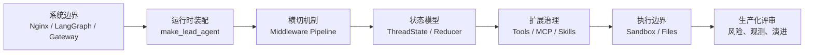

**主结论**：DeerFlow 不是“一个聊天接口调用一个 LLM”，而是一个 Agent 运行平台。它把 LangGraph 执行状态、DeerFlow 产品状态、外部工具生态、文件副作用和沙箱执行边界拆成多层协作。

## 1. 一张图看全局架构

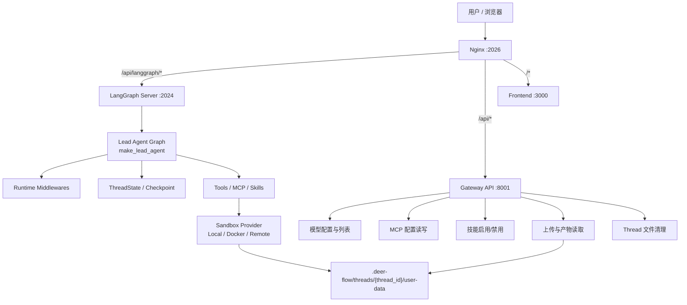

| 面 | 代表入口 | 主要职责 | 分享时要强调的点 |
| --- | --- | --- | --- |
| 运行面 | LangGraph Server / `make_lead_agent` | Agent 图执行、middleware、模型和工具循环、checkpoint | 尽量贴近 LangGraph 原生运行模型 |
| 管理面 | Gateway API | 模型、MCP、技能、上传、产物、线程文件清理 | 把配置和文件副作用从 Agent 执行链路拆出去 |
| 扩展面 | tools / MCP / skills / sandbox | 工具、模型 provider、技能指令、执行环境注入 | Agent 能力通过配置和扩展装配 |

## 2. 路由边界：为什么不是一个 FastAPI 单体

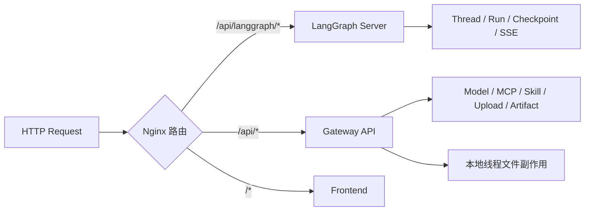

`/api/langgraph/*` 保持 LangGraph wire protocol，方便前端贴近 thread、run、SSE、checkpoint 语义。`/api/*` 则承接 DeerFlow 自己引入的管理状态和文件副作用。

**代码走读点**

| 主题 | 文件 |
| --- | --- |
| Gateway 入口 | `backend/app/gateway/app.py` |
| Thread 删除与清理 | `backend/app/gateway/routers/threads.py` |
| 上传与产物 | `backend/app/gateway/routers/uploads.py` |

## 3. Agent 装配链路：`make_lead_agent` 做了什么

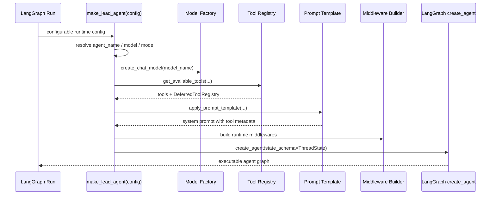

**关键判断**

- 工具加载必须早于 prompt 生成，否则模型看到的工具描述和实际 tool binding 可能不一致。
- 模型解析是“请求配置 > Agent 配置 > 全局默认”的优先级，fallback 需要可观测性。
- bootstrap 模式会限制 skills 并额外装配 setup agent，说明 DeerFlow 已经有 Agent Platform 雏形。

代码入口：`backend/packages/harness/deerflow/agents/lead_agent/agent.py`

## 4. Middleware 不是 Web 中间件

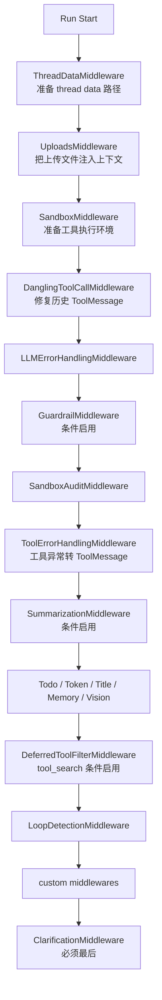

这条链路运行在 Agent 图执行过程中，生命周期点包括 `before_agent`、`before_model`、`after_model`、`wrap_tool_call`。它们共享并改写同一个 `ThreadState`，所以排序是业务语义，不是装饰器顺序。

**排序约束示例**

| 约束 | 原因 |
| --- | --- |
| `ThreadDataMiddleware` 在 `SandboxMiddleware` 前 | sandbox 需要 thread data 路径 |
| `UploadsMiddleware` 在 `ThreadDataMiddleware` 后 | 上传文件路径依赖 thread data |
| `DanglingToolCallMiddleware` 在模型前 | 模型看到历史前要修复缺失 ToolMessage |
| `ClarificationMiddleware` 最后 | 它要拦截工具调用后的澄清请求 |

代码入口：`backend/packages/harness/deerflow/agents/middlewares/tool_error_handling_middleware.py`

## 5. Tool Error 设计：失败不是立即终止

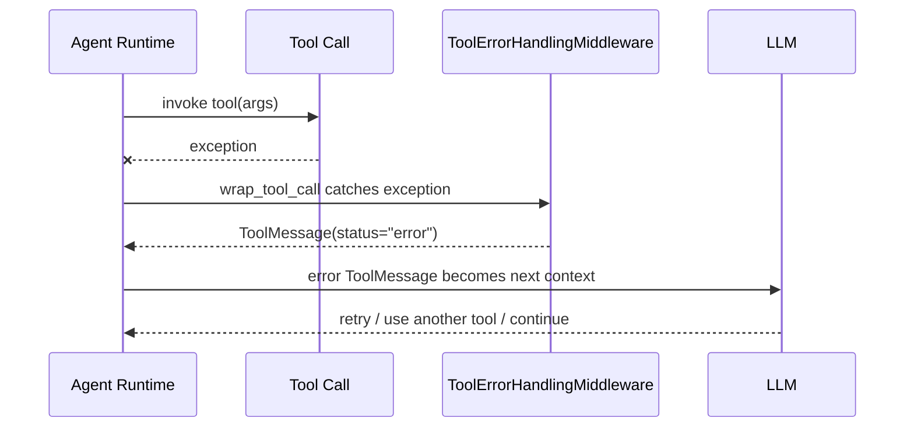

这个设计把“工具失败”降级成“模型下一轮推理的输入”。但 `GraphBubbleUp` 必须继续抛出，因为它是 LangGraph 的控制流信号，例如 interrupt、pause、resume，不能误包装成普通工具错误。

## 6. ThreadState：状态不是普通 dict

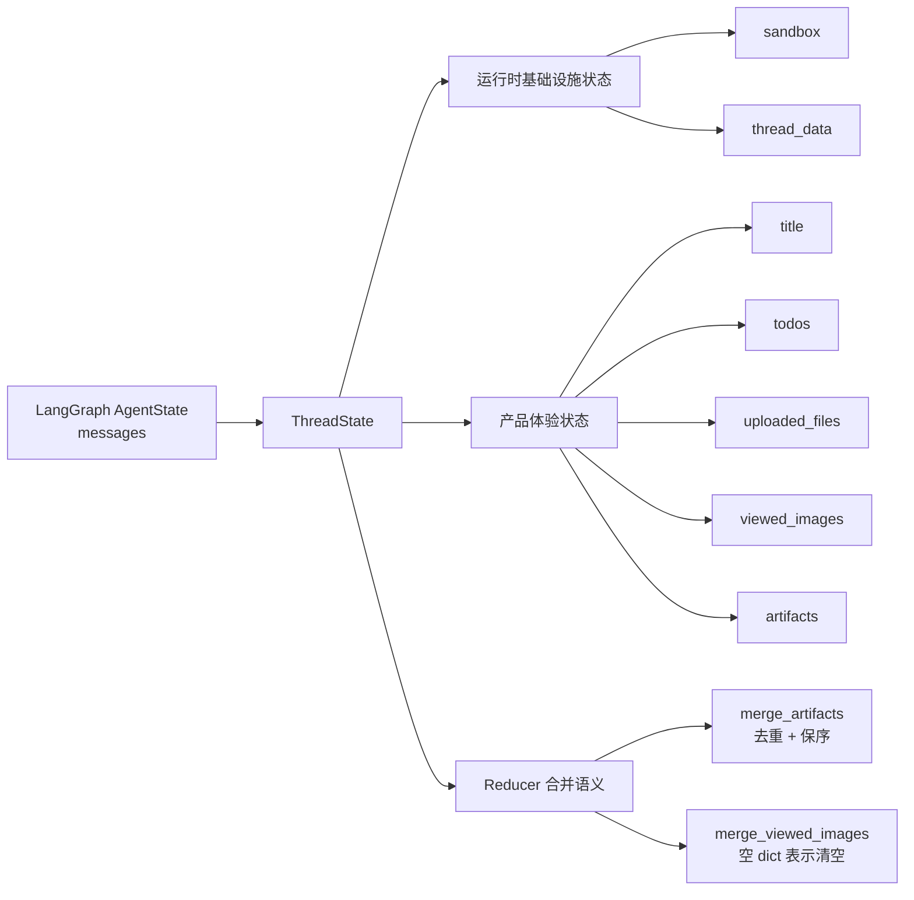

`ThreadState` 是 LangGraph state channel。字段合并规则会影响图执行结果，而不只是类型标注。

| 状态类别 | 字段 | 设计含义 |
| --- | --- | --- |
| 框架核心状态 | `messages` | Agent 对话和工具调用主轴 |
| 运行时基础设施状态 | `sandbox`, `thread_data` | 工具执行、路径映射、文件隔离依赖 |
| 产品体验状态 | `title`, `todos`, `uploaded_files`, `viewed_images`, `artifacts` | UI、多模态和产物体验 |

代码入口：`backend/packages/harness/deerflow/agents/thread_state.py`

## 7. 文件数据面：ThreadData、Uploads、Sandbox 的关系

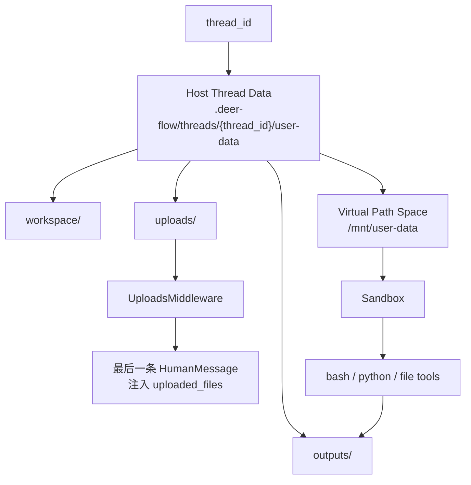

ThreadData 解决“每个 thread 的文件隔离和路径映射”；Uploads 解决“上传文件如何进入模型上下文”。这两个概念不要混在一起。

**值得强调**

- `ThreadDataMiddleware` 只负责把路径状态写进 `ThreadState`。
- `UploadsMiddleware` 会改写最后一条 `HumanMessage`，把上传文件作为上下文注入。
- 上传文件过多时会膨胀 prompt，生产环境需要文件摘要、检索或按需读取策略。

## 8. Sandbox：开发便利和安全边界要分清

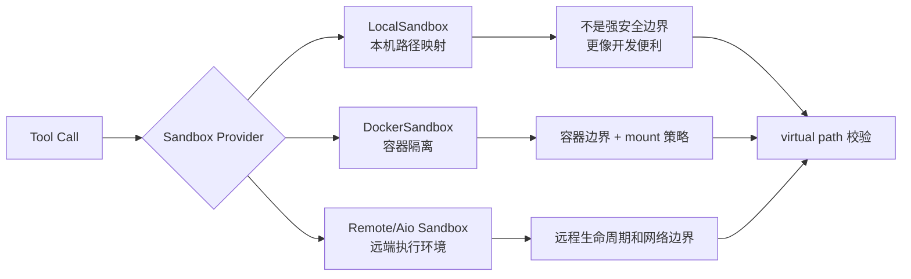

分享时不要把 LocalSandbox 讲成安全沙箱。它主要解决开发模式的路径映射和工具执行便利。真正上生产时，要重点审查 provider 的隔离能力、mount 策略、网络访问、资源限制和审计日志。

代码入口：

- `backend/packages/harness/deerflow/sandbox/middleware.py`
- `backend/packages/harness/deerflow/sandbox/sandbox_provider.py`
- `backend/packages/harness/deerflow/sandbox/tools.py`

## 9. 工具系统：工具不是列表，是治理边界

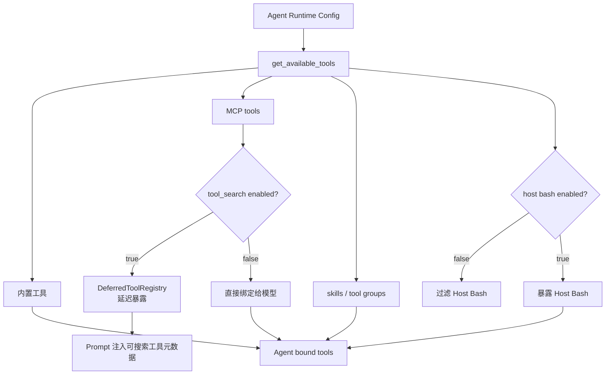

这里的核心不是“有哪些工具”，而是“哪些工具在什么条件下能被模型看到”。Host bash 默认不暴露是安全选择；tool_search 把 MCP 工具从“全部直接给模型”改成“按需发现”，是治理手段。

代码入口：`backend/packages/harness/deerflow/tools/tools.py`

## 10. MCP 热更新：mtime cache 的工程折中

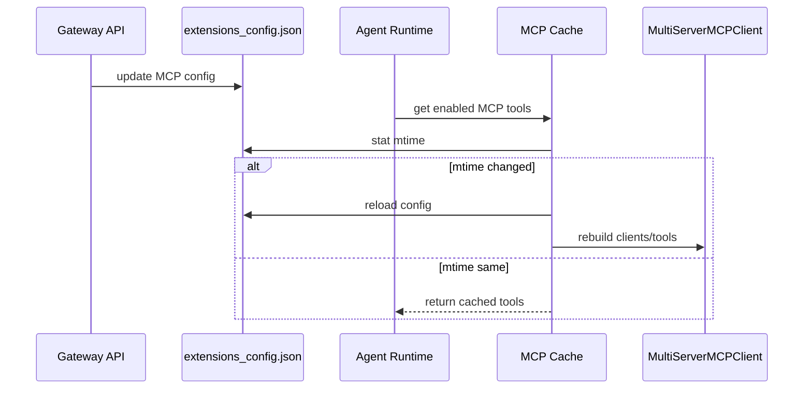

这个设计适合单机和本地开发：实现简单，避免每次 run 都重建 MCP client。多实例部署时，它会变成一致性问题：不同实例看到的本地文件、mtime 和缓存刷新时机可能不同。

**生产化演进方向**

| 当前机制 | 风险 | 演进方向 |
| --- | --- | --- |
| 本地 JSON + mtime cache | 多副本配置不同步 | 配置中心 / DB version / pub-sub invalidation |
| async MCP tool 包 sync callable | 并发下 timeout/cancel/backpressure 不统一 | 统一 tool execution policy |
| DeferredToolRegistry | prompt 和 runtime 有顺序依赖 | 增加 registry 快照和一致性校验 |

代码入口：

- `backend/packages/harness/deerflow/mcp/cache.py`
- `backend/packages/harness/deerflow/mcp/tools.py`

## 11. 模型工厂：配置驱动 provider

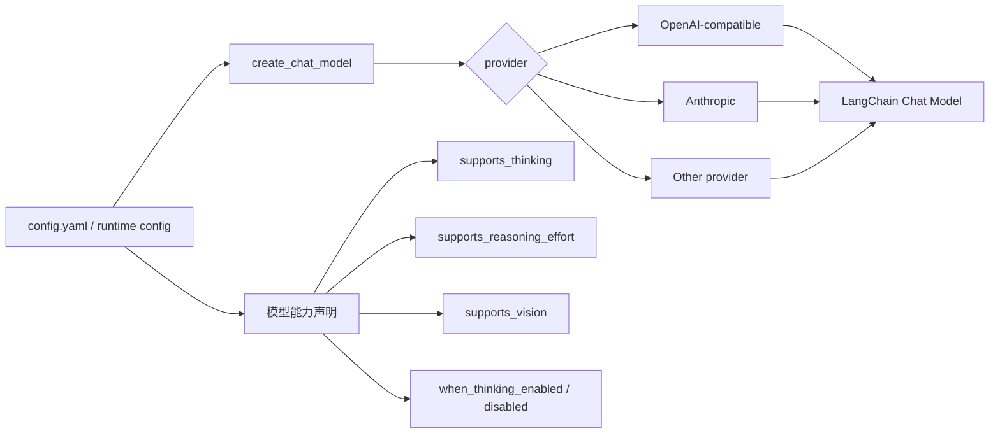

模型切换不是散落在业务代码里的 `if/else`，而是通过配置表达 provider、能力和参数转换规则。一个值得讲的细节是 `stream_usage`：OpenAI-compatible gateway 使用 custom base URL 时，工厂层需要主动补齐 usage streaming，才能支撑 token usage 观测。

代码入口：`backend/packages/harness/deerflow/model/factory.py`

## 12. 上传链路：为什么在 Gateway，不在 Agent runtime

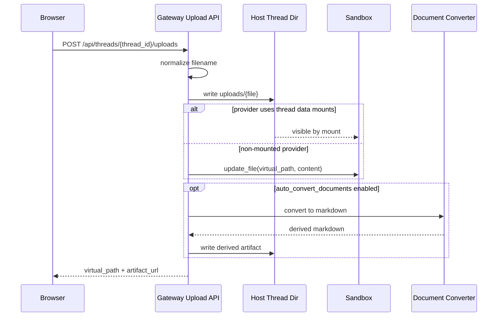

上传 router 知道 sandbox provider 的数据可见性模型，所以它不是简单文件服务。默认关闭自动文档转换也是安全选择：文档解析依赖复杂、资源消耗高，还会产生派生文件同步问题。

代码入口：`backend/app/gateway/routers/uploads.py`

## 13. Thread 删除：best-effort 的一致性代价

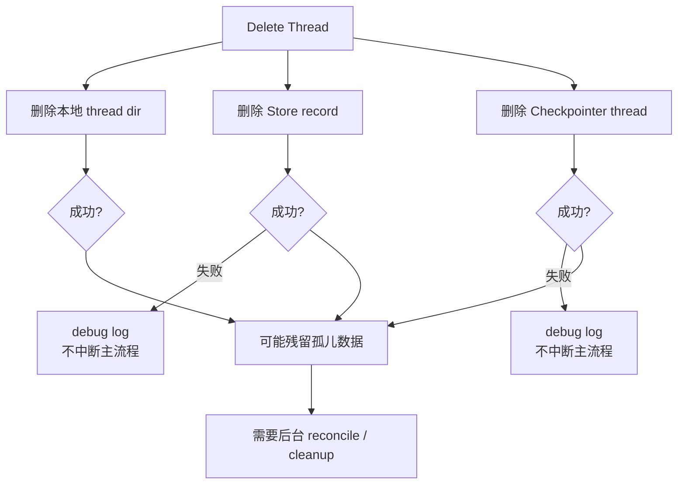

best-effort 让 UI 删除操作更可用，但代价是运维侧要接受孤儿 checkpoint、孤儿 thread dir 或孤儿 store record 的可能性。生产环境建议补周期性 reconcile。

代码入口：`backend/app/gateway/routers/threads.py`

## 14. 生产化评审图

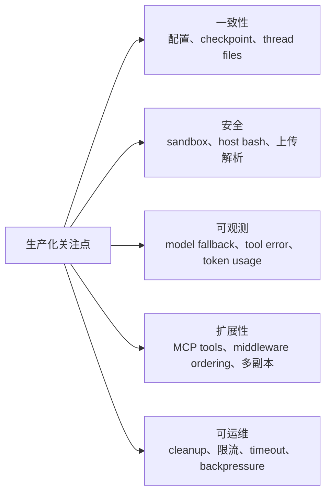

| 维度 | 当前强项 | 主要风险 | 建议演进 |
| --- | --- | --- | --- |
| 边界 | LangGraph runtime 和 Gateway management plane 分离 | 删除不是强事务 | 增加聚合删除或 reconcile |
| 扩展 | 模型、MCP、skills、tools 都可配置 | 配置一致性依赖本地文件 | 配置版本化和失效广播 |
| 安全 | host bash 默认不暴露，路径做 virtual mapping | LocalSandbox 容易被误解为安全隔离 | 明确 provider 安全等级 |
| 可靠性 | tool error 转 ToolMessage，模型可自恢复 | middleware ordering 是隐式契约 | 声明式 dependency 或启动校验 |
| 观测 | token usage、audit middleware 有基础 | model fallback 和 MCP cache 刷新不够显性 | 增加 runtime decision trace |

## 15. 现场代码走读路线

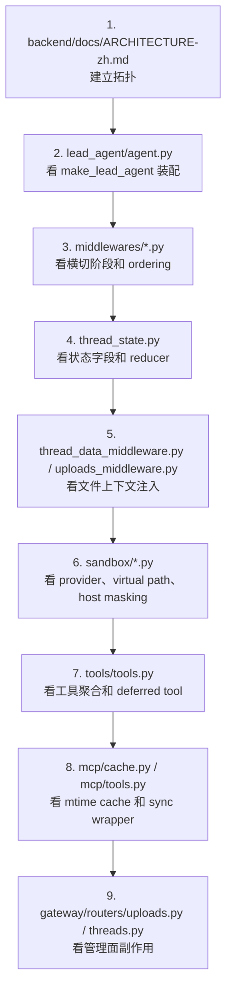

建议现场不要从目录结构开始讲，而是按一次 run 的生命周期讲：请求进入、Agent 装配、middleware 改写状态、模型调用工具、文件进出 sandbox、Gateway 清理副作用。

## 16. 讨论题

1. 多副本部署时，`extensions_config.json` 的 mtime cache 是否还能成立？
2. Tool search 是否应该成为 MCP 工具的默认暴露路径？
3. `uploaded_files` 是否应该从 message 注入改为 retrieval/tool metadata 按需读取？
4. Thread 删除要不要从 best-effort 演进到带 reconcile 的最终一致？
5. LocalSandbox、DockerSandbox、RemoteSandbox 是否需要在配置或 UI 上明确安全等级？
6. Middleware ordering 能否做成声明式依赖，而不是靠人工维护顺序？
7. MCP tool call 是否需要统一 timeout、限流、cancel 和 backpressure？

## 17. 一句话收束

DeerFlow 值得学习的不是“怎么调用 LLM”，而是它如何把 LangGraph 的执行模型、产品态文件管理、MCP 工具体系、模型配置和 sandbox 边界组合成一个可装配、可恢复、可治理的后台 Agent 平台。
